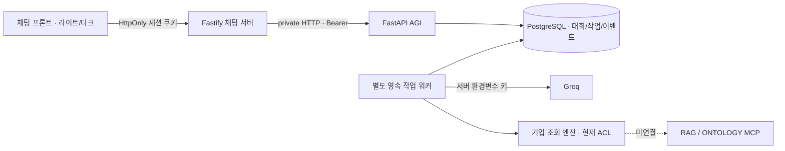

# MODAM-CHAT ↔ MODAM-AGI 연동 계약

2026-10-08 사용자 구축안 승인 기준. 브라우저는 같은 origin의 `/api`만 호출한다.

## HTTP 계약

BFF `/api`와 AGI `/v1`의 아래 경로는 동일하다. 공개 진입점은 BFF뿐이다.

| 메서드     | 경로                               | 의미                                                            |
| ---------- | ---------------------------------- | --------------------------------------------------------------- |
| POST       | `/auth/login`                      | ID/PW → BFF가 opaque 세션 쿠키 설정. 브라우저에 token 반환 금지 |
| POST       | `/auth/logout`                     | 서버 세션 폐기·쿠키 제거                                        |
| GET        | `/session`                         | 현재 사용자·Role·Cloud 정책                                     |
| POST / GET | `/conversations`                   | 일반/기업 모드 대화 생성 / 소유 대화 최근 100개                 |
| GET        | `/conversations/{id}/messages`     | 소유 대화의 메시지와 진행 중 run 복원                           |
| DELETE     | `/conversations/{id}`              | 소유 대화/작업/이벤트 삭제. 활성 실행 중에는 409                |
| POST       | `/conversations/{id}/runs`         | 신규 메시지 실행 요청, 202 + run ID                             |
| GET        | `/runs/{id}`                       | 작업 상태·최종 답변 조회                                        |
| GET        | `/runs/{id}/events?after={cursor}` | SSE 재구독. Last-Event-ID도 지원                                |
| POST       | `/runs/{id}/cancel`                | 실행 중단                                                       |
| POST       | `/requests/{request_id}/cancel`    | 생성 전 취소 경합 방지                                          |
| GET / POST | `/admin/users`                     | Admin 사용자 목록 / ID·PW 사용자 생성                           |
| PUT        | `/admin/users/{id}/policy`         | Admin 복수 Role·정확한 action/scope·활성/Cloud 정책 관리        |

입력은 `{request_id, message, cloud_allowed}`뿐이다. request_id는 8..100 URL-safe 문자. message는 trim 후 1..4,000 Unicode code point, cloud_allowed는 엄격한 bool이며 명시적으로 true여야 전송한다. 임의 history/subject/권한 필드는 422다. 대화 모드는 생성 시 `general` 또는 `enterprise`이며 기존 대화의 모드는 바꾸지 않는다.

작업은 `queued → running → completed|failed|cancelled`다. 업무 outcome은 completed/clarification_required/denied/not_available/failed 등 별도 필드다. 도구 미연결을 성공으로 표시하지 않는다. SSE는 accepted/status/message/done/error/cancelled이며 `id`는 PostgreSQL 이벤트의 단조 증가 cursor다. 전체 JSON 답변을 검증한 후 final message를 보낸다. 토큰 스트리밍·가짜 타이핑은 운영 모드에서 제공하지 않는다.

401은 로그인 필요, 403은 origin/관리 권한 거절, 404는 미존재 또는 다른 사용자 자원, 409는 요청 ID 내용 충돌·동시 실행·삭제 경합, 422는 입력 오류, 502는 BFF에서 AGI 연결 실패다. 실패 안내에 내부 예외·키를 표시하지 않는다.

## 보안·재실행·맥락

- Argon2id PW, SHA-256 digest만 저장하는 24시간 opaque 세션. HttpOnly·SameSite=Strict 쿠키; production Secure 강제 및 HTTPS origin 필수. 변경 요청에 `X-Modam-Request: 1`, Origin 허용 목록 검사. BFF 로그인 IP별 1분 10회 제한; BFF 외부 접속 전 운영 게이트웨이의 추가 제한이 필요하다.
- DB transaction/row lock/unique index로 사용자별 request_id 멱등성과 대화당 활성 실행 하나를 보장한다. 동일 내용 재전송은 기존 실행을 반환한다. 여러 탭·서버 인스턴스에서도 DB가 기준이다.
- HTTP/SSE 단절은 취소가 아니다. 재구독과 상태 조회만 수행하며 새 모델 실행을 만들지 않는다. 명시적 중단은 DB 상태 변경과 워커 task 취소를 모두 수행한다. 이미 Groq에 전송된 요청의 과금/제공자 처리까지 철회한다고 보장하지 않는다.
- 워커는 DB queued job을 SKIP LOCKED로 claim한다. running은 전체 timeout+30초 lease를 갖는다. 프로세스 장애 후 lease 만료 시 `failed/worker_lost`로 종료하며 결과 불명인 모델 호출은 자동 반복하지 않는다. queued job은 다른 워커가 처리한다.
- canonical completed turn 최근 10개와 총 20,000 code point 예산을 사용한다. 취소/실패 턴은 제외한다. 일반 대화는 일반 Groq 경로, 기업 조회는 기존 Engine과 현재 Authority를 사용한다. 모호한 지시 대상은 확인 질문으로 처리한다.
- 기업 답변의 현재 action/scope를 표시/재생할 때 재검사한다. 과거 기업 조회 답변은 새 모델 context에 원문으로 넣지 않으며 현재 데이터 재조회 필요 표식으로 대체한다. 최신 재고/규정을 과거 답변에서 추정하지 않는다.
- Admin Role은 기업 조회 권한을 자동 부여하지 않는다. Role은 admin/user 복수 선택이고 업무 권한은 정확한 action/scope grant 목록이다. 임의 Role 정의/Role별 grant 템플릿은 후속 범위다. 승인/ERP 변경 도구는 아직 미구현이다.
- 대화는 마지막 새 실행 요청 이후 30일 보관하며 워커가 시간 단위로 정리한다. 사용자 삭제 API/UI를 지원한다. 보관 기간은 Groq 제공자의 데이터 정책을 변경하지 않는다. 실제 MCP 문서·벡터·그래프를 AGI DB에 복제하지 않는다.

## 검증 경계

SQLite 단위 테스트는 DB 상태·취소·현재 정책·안전한 장애 복구를 재현한다. 운영 DB는 PostgreSQL이다. 실제 PostgreSQL/BFF/FastAPI/별도 워커/Groq의 3턴 및 브라우저 검증은 검증 기록에 따로 기록한다. 실제 MCP/ERP 연결 및 동시 사용자 부하·물리 IME 검증은 완료로 주장하지 않는다.
