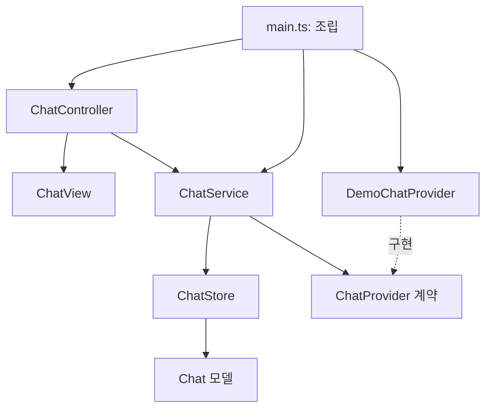

# 아키텍처와 SOLID

## 의존 방향

`domain`은 DOM·Vite·네트워크를 참조하지 않습니다. `application`은 데모 제공자를 참조하지 않습니다. 제공자 선택은 `main.ts`에서만 하며 생성자 주입을 사용합니다.

| 모듈             | 책임                                    |
| ---------------- | --------------------------------------- |
| ChatStore        | 입력 제약, 대화 생성/선택, 메모리 상태  |
| ChatService      | 요청 실행·중복 방지·취소·완료·오류 조율 |
| ChatProvider     | 입력/스트림 계약                        |
| DemoChatProvider | 데모 문장과 취소 가능한 청크 생성       |
| ChatView         | DOM 표시, 입력 상태, 복사 피드백        |
| ChatController   | 사용자 이벤트를 유스케이스로 연결       |
| main.ts          | 객체 생성과 의존성 연결                 |

## SOLID

- **SRP:** 상태·요청 조율·제공자·DOM·이벤트의 변경 이유를 분리합니다.
- **OCP:** 제공자 구현을 추가하고 조립 지점만 바꾸어 응답 출처를 확장합니다. 유스케이스에 모델별 분기를 넣지 않습니다.
- **LSP:** 모든 제공자는 순서 있는 문자열 청크와 AbortSignal 계약을 지켜야 합니다.
- **ISP:** 제공자 계약은 `stream` 하나입니다. 업로드/로그인 같은 무관한 메서드를 넣지 않습니다.
- **DIP:** 서비스는 구체 제공자 대신 ChatProvider 계약에 의존하며 테스트도 동일 계약 대역을 사용합니다.

SOLID는 판단 기준이지 클래스 개수를 늘리는 목표가 아닙니다. 아직 필요 없는 인증·저장 서버 추상 계층을 만들지 않습니다.

## 동시성·상태

활성 요청 하나만 허용합니다. 중단 후 도착한 청크는 서비스에서 다시 취소 신호를 확인해 버립니다. 이전 요청의 완료 처리는 현재 활성 요청이 같은 요청일 때만 busy를 해제합니다. 취소 직후 시작된 새 요청을 이전 요청이 덮어쓰지 않아야 합니다.

UI 조회는 복제한 스냅샷을 사용합니다. 현재는 청크마다 대화 스냅샷과 메시지 DOM을 다시 생성합니다. 실제 스트리밍 빈도/대화 길이가 커지면 측정 후 프레임 배치·부분 렌더링을 도입하세요. 대규모 성능 보장을 주장하지 않습니다.

## ADR-001: 기존 HTML/CSS 유지

한 화면에 필요한 도구만 사용하여 TypeScript + Vite로 관리합니다. React/라우터/상태 라이브러리는 UI 규모·팀 역량·요구가 커질 때 별도 ADR로 검토합니다. 프레임워크 추가 자체를 기업 표준으로 보지 않습니다.
